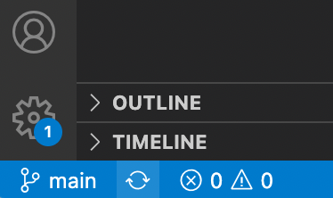
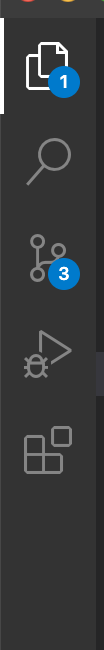
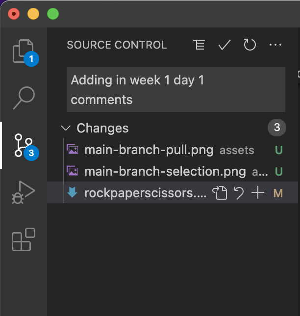
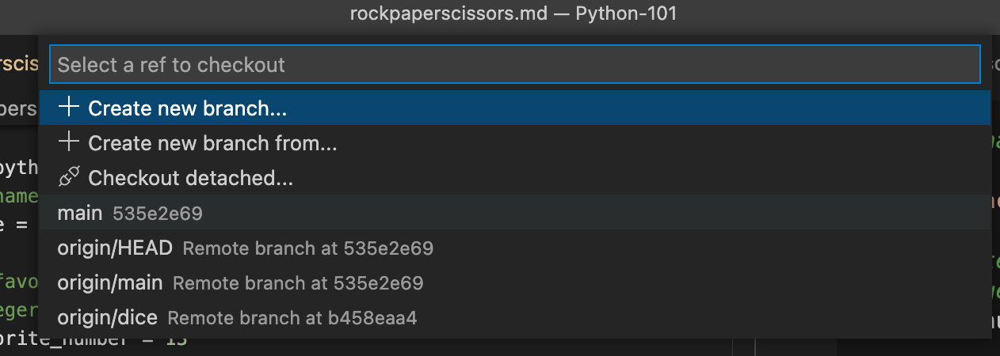
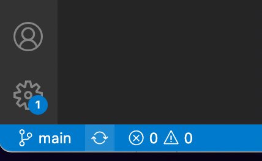
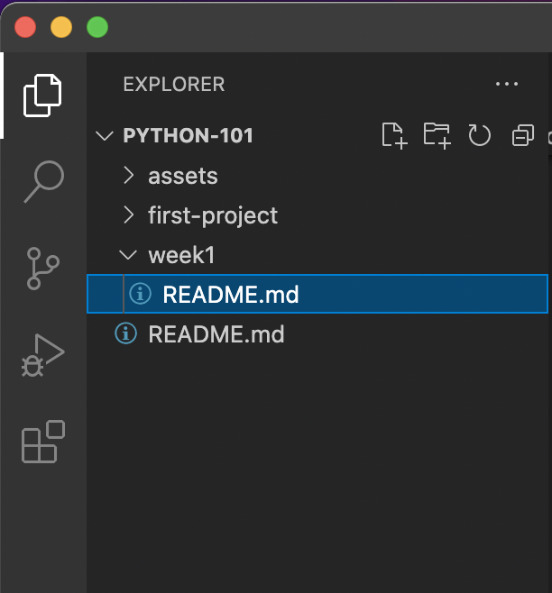
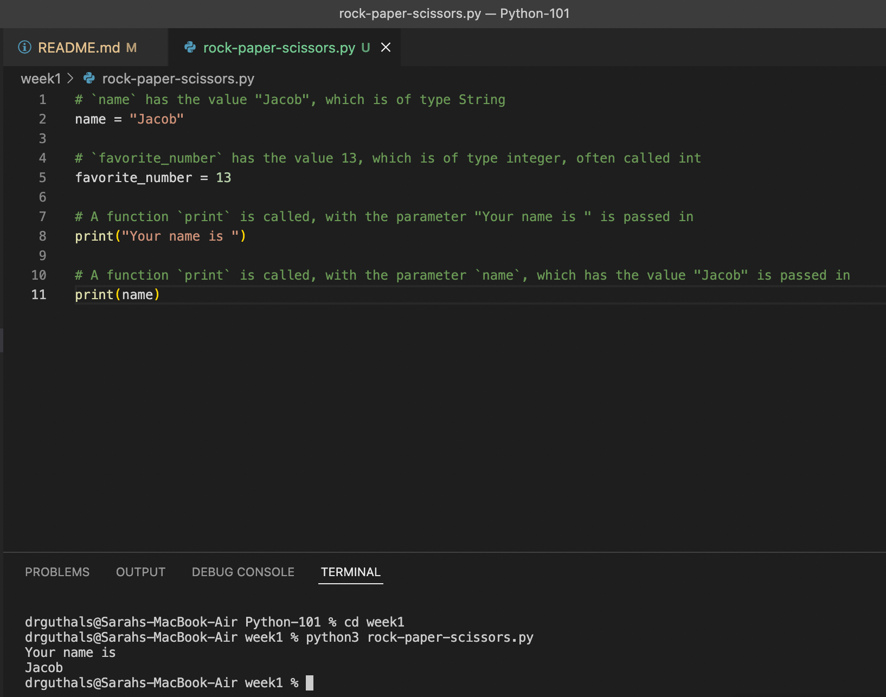

# Week 1: Rock Paper Scissors

This is a recap of what we covered in our first session last week. Follow along and then try to work on the project described at the bottom of this page. 

## Variables

Variables are names given to values. For example:

```python
# A variable called `name` with the value "Jacob"
name = "Jacob"

# A variable called `favorite_number` with the value 13
favorite_number = 13
```

## Types

In Python, types are not explicitly set, but you have already learned about two types of data:

```python
# `name` has the value "Jacob", which is of type String
name = "Jacob"

# `favorite_number` has the value 13, which is of type integer, often called int
favorite_number = 13
```

## Calling Functions

Functions are named parts in code that can be "called". For example:

```python
# `name` has the value "Jacob", which is of type String
name = "Jacob"

# `favorite_number` has the value 13, which is of type integer, often called int
favorite_number = 13

# A function `print` is called, with the parameter "Your name is " is passed in
print("Your name is ")

# A function `print` is called, with the parameter `name`, which has the value "Jacob" is passed in
print(name)
```

## Get VSCode ready
Before continuing, let's make sure your VS Code is setup for what we will be doing next:
1. Open Visual Studio Code
2. At the bottom of VS Code, check to see if you're on the main branch (it will say `main`)  

3. If it doesn't say main, check to see if you have any pending commits. If you do, you will have a number on the Source Control tab:  

4. If you have uncommitted changes, click into the Source Control pane, type a message at the top of the pane, click the check mark button. Then press Sync Changes.  

5. After you have synced your changes, you should no longer have a notification on the Source Control button.   
6. At the bottom of VSCode again, click on the name of the branch and when the branch chooser pops up, click `main`

7. Click on the arrow circle to pull down changes.  


Your File Explorer pane should now look like this:  


Click on the `week1` folder and then add a new file by clicking on the paper with the `+` on it at the top of the File Explorer pane.

Name the new file `rock-paper-scissors.py` and push Enter.

## Run Python Code

Let's re-visit the example from above:

```python
# `name` has the value "Jacob", which is of type String
name = "Jacob"

# `favorite_number` has the value 13, which is of type integer, often called int
favorite_number = 13

# A function `print` is called, with the parameter "Your name is " is passed in
print("Your name is ")

# A function `print` is called, with the parameter `name`, which has the value "Jacob" is passed in
print(name)
```

Copy the above code into your `rock-paper-scissors.py` file in VS Code. 

Then, open a new Terminal by clicking `Terminal`->`New Terminal` in the top menu bar. 

In your terminal type:
```bash
% cd week1
% python3 rock-paper-scissors.py
```

And you should see:
```bash
Your name is
Jacob
```



## Your turn to try

Now you need to make some changes to your code to make the following happen:
```bash
% python3 rock-paper-scissors.py
Your name is 
Jacob
Your favorite number is
13
% 
```

## String Concatenation

You might remember that these will not print the same thing:

```python
print(5+5)
print("5"+"5")
```

The first is addition of two integers. The second is "string concatenation", which means to put two strings together.

Output:
```bash
10
55
```

One new thing is you can actually concatenate strings to print by adding more parameters too, for example:
```python
print("ahh","hhhh")
```

Would print:
```bash
ahh hhhh
```

Notice that the print function added a space in between the two strings. 

## Your turn to try

From what you know so far, try to print this:
```bash
Your name is Jacob and your favorite number is 13
```

Make sure you use `name` and `favorite_number`. The answer is **not**:
```python
print("Your name is Jacob and your favorite number is 13")
```

## GitHub Sync check

Before you do anything else, make sure you:
1. Save all of your files
2. Commit them to your new branch
3. Sync the changes

## User Input

Take a look at last week's projects, getting user input is actually pretty straightforward:
```python
name = input("What is your name? ")
```

If your file had that line it in, then when the computer go to that line it would print "What is your name?" and then wait for you to type something and then click Return. 

Once you did, it would store the value you input into the variable called `name`. 

## Your turn to try
From what you know so far, try to change the profram to take input from a user:
```bash
What is your name? Sarah
What is your favorite number? 13
Your name is Sarah and your favorite number is 13
```

## GitHub Sync check

Before you do anything else, make sure you:
1. Save all of your files
2. Commit them to your new branch
3. Sync the changes

## Still have time?

If you want to keep going before we meet on Wednesday, you can try to add a random number that gets printed as the age of the player:
```bash
What is your name? Sarah
What is your favorite number? 13
Your name is Sarah and your favorite number is 13
I predict your age to be 4
```
Where 4 is random every time this program runs. 

# Day 2 Homework

Finish 